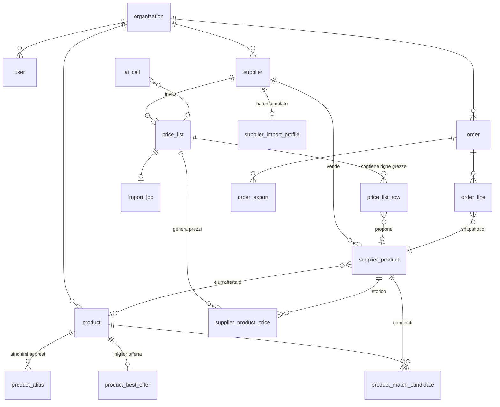

# Gelateria Guido — Gestione ordini e listini fornitori

## Analisi tecnica del progetto

> Documento di progettazione. Nessun codice applicativo è ancora stato scritto.
> La roadmap operativa per fasi sta in [ROADMAP.md](ROADMAP.md).
> Le domande aperte da chiudere prima di iniziare stanno in [DECISIONI.md](DECISIONI.md).

Data: 2026-08-07 · Server: VPS filippo.eventoyou.com (4 core, 7 GB RAM, 115 GB liberi)

---

## 0. Il problema in una frase

Trasformare PDF eterogenei e non strutturati (i listini dei fornitori) in un
catalogo confrontabile, e poi rendere l'ordine quotidiano un'operazione da
pochi secondi, sapendo sempre se si sta comprando al prezzo migliore.

Le due difficoltà vere sono:

1. **L'estrazione**: ogni fornitore ha un PDF diverso, e un prezzo estratto
   male entra nello storico e ci resta, avvelenando confronti e ordini futuri
   in modo silenzioso.
2. **Il riconoscimento**: capire che "Birra XYZ 33cl x12" e "XYZ Birra cl.33
   conf. 12pz" sono la stessa cosa, senza sbagliare — perché un falso positivo
   fa consigliare il fornitore sbagliato, e un falso negativo fa sparire il
   confronto.

Tutto il resto (ordini, storico, Excel, statistiche) è lavoro normale e a
basso rischio. **Il progetto si gioca sui punti 1 e 2**, e l'architettura qui
sotto è pensata attorno a quelli.

---

## 1. Architettura generale

### 1.1 Principio guida: l'IA propone, il codice dispone

```
┌──────────────────────────────────────────────────────────────────┐
│  ZONA NON DETERMINISTICA (IA)          ZONA DETERMINISTICA (codice)│
│                                                                    │
│  • inferenza mappatura colonne         • parsing unità di misura   │
│  • riga disordinata → campi            • prezzo/kg, prezzo/litro   │
│  • "stesso prodotto?" sì/no            • variazioni %              │
│  • spiegazione anomalie                • storico prezzi            │
│                                        • confronto e miglior offerta│
│         ↓ produce PROPOSTE             • totali ordine, IVA        │
│         ↓ in tabelle di staging        • export Excel              │
│         ↓                                                          │
│  ┌────────────────────────────────┐                                │
│  │ VALIDAZIONE (zod + regole di   │  ← nessun dato IA raggiunge    │
│  │ business) + REVISIONE UMANA    │     le tabelle di dominio      │
│  └────────────────────────────────┘     senza passare di qui       │
└──────────────────────────────────────────────────────────────────┘
```

Questo è il vincolo architetturale numero uno, e viene direttamente dal punto
15 della tua specifica. Nessun calcolo passa dall'IA. L'IA scrive solo in
tabelle di staging (`price_list_row`, `product_match_candidate`), mai nelle
tabelle di dominio (`supplier_product`, `supplier_product_price`, `order_*`).

### 1.2 Componenti

```
                        nginx (filippo.eventoyou.com)
                                    │
                        /gelateria/ │ proxy_pass 127.0.0.1:3030
                                    ▼
              ┌─────────────────────────────────────────┐
              │   Next.js (App Router) — un processo    │
              │                                          │
              │  UI (React Server Components + client)   │
              │  Route handlers / server actions         │
              │  ────────────────────────────────────    │
              │  server/domain/   logica pura, testabile │
              │  server/import/   pipeline PDF           │
              │  server/ai/       provider LLM astratto  │
              │  server/export/   modulo Excel           │
              │  server/jobs/     esecutore job import   │
              └────────┬──────────────────┬──────────────┘
                       │                  │
              ┌────────▼───────┐  ┌───────▼────────┐   ┌──────────────┐
              │  PostgreSQL 16 │  │  storage/      │   │ DeepSeek API │
              │  gelateria_db  │  │  PDF originali │   │ (HTTPS out)  │
              │  pg_trgm       │  │  export .xlsx  │   └──────────────┘
              │  unaccent      │  └────────────────┘
              └────────────────┘         │
                                  ┌──────▼──────┐
                                  │  pdftotext  │  (poppler, già installato)
                                  │  pdfimages  │
                                  └─────────────┘
```

**Un solo processo Node.** È una scelta deliberata: il carico è I/O-bound
(chiamate LLM, query), l'unica parte CPU-bound (`pdftotext`) gira come
processo figlio, e sul VPS ci sono già `china-web`, `china-api`,
`menu-digitale`, MySQL, Postgres e Redis a contendersi 7 GB di RAM. Un
secondo processo worker aggiungerebbe superficie operativa senza guadagno
misurabile a questa scala.

L'import gira comunque **come job asincrono con checkpoint su database**
(non dentro la richiesta HTTP): l'utente carica il PDF, riceve subito un
`import_job` e segue l'avanzamento in polling. Se il processo si riavvia a
metà, il job riparte dall'ultimo lotto committato. Il modulo
`server/jobs/runner.ts` è scritto con un'interfaccia che permette di
estrarlo in un processo separato (o dietro BullMQ/Redis, già disponibile)
il giorno in cui servisse, senza toccare la logica di import.

### 1.3 Perché non la struttura di `china`

`china` è un monorepo pnpm + Turbo con NestJS, Next, un worker BullMQ e
quattro package interni. Ha senso lì: fan-out di ricerche su marketplace
esterni, code di lavoro lunghe, più superfici API. Qui la superficie è una
sola app usata da 1–3 persone. Il monorepo aggiungerebbe un build system,
un layer di package interni e un secondo servizio systemd per zero vantaggi
oggi. **Prendiamo però da `china` le idee che hanno già funzionato**:

- l'astrazione provider AI (`analysis-provider.ts`) con versione del prompt
  nella chiave di cache e nessun fallback silenzioso tra modelli;
- la validazione zod di ogni risposta LLM;
- il logging costi/token per chiamata;
- Prisma 7 + Postgres, Next 16 + React 19, `basePath` per il sottopercorso nginx.

Se un domani servisse davvero il monorepo, la struttura a cartelle proposta
(§15) si converte in package senza riscritture: `server/domain`, `server/ai`,
`server/import` sono già isolati e senza dipendenze da React o da Next.

---

## 2. Stack tecnologico consigliato

| Livello        | Scelta                                                                                          | Perché                                                                                                                                                                                        |
| -------------- | ----------------------------------------------------------------------------------------------- | --------------------------------------------------------------------------------------------------------------------------------------------------------------------------------------------- |
| Runtime        | **Node 22** (già sul server)                                                                    | allineato a `china`, LTS                                                                                                                                                                      |
| Linguaggio     | **TypeScript** strict                                                                           | il dominio è pieno di unità di misura e denaro: i tipi qui pagano davvero                                                                                                                     |
| Framework      | **Next.js 16 (App Router) + React 19**                                                          | UI e API nello stesso processo; server components per liste grandi senza JS lato client; già in uso e già deployato dietro nginx con `basePath`                                               |
| Stile          | **Tailwind CSS 4** + componenti propri (pattern shadcn/ui)                                      | la schermata ordine ha bisogno di controllo fine e di essere veloce su tablet; niente libreria pesante                                                                                        |
| Database       | **PostgreSQL 16** (locale, già attivo)                                                          | `pg_trgm` per la ricerca fuzzy dei prodotti, `unaccent`, `numeric` per il denaro, transazioni serie per l'apply dell'import. MySQL c'è ma Postgres è quello che usiamo con Prisma             |
| ORM            | **Prisma 7**                                                                                    | stesso di `china`; migrazioni versionate; `Decimal` mappato su `numeric`                                                                                                                      |
| Validazione    | **zod 4**                                                                                       | uno schema solo per: form, API, e output LLM                                                                                                                                                  |
| Denaro         | **Prisma.Decimal / decimal.js**                                                                 | mai `float` su prezzi e totali                                                                                                                                                                |
| PDF (testo)    | **poppler `pdftotext -layout` / `-bbox-layout`** (già installato)                               | conserva l'allineamento delle colonne, che è metà del lavoro di segmentazione                                                                                                                 |
| PDF (immagini) | **`pdfimages`** (già installato)                                                                | estrazione foto prodotto, opzionale                                                                                                                                                           |
| LLM            | **DeepSeek** (`deepseek-v4-flash`, endpoint OpenAI-compatible) dietro interfaccia `LlmProvider` | costo ~$0,14/$0,28 per Mtok: permette lotti piccoli e una seconda passata di revisione, che è esattamente ciò che serve qui. Sostituibile con Claude/altro cambiando una variabile d'ambiente |
| Excel          | **`xlsx` (SheetJS 0.18.5)** o **`exceljs`**                                                     | `xlsx` è già in uso in `china`; `exceljs` se servirà formattazione ricca (colori, larghezze, formule). Decisione rimandabile: il modulo export è isolato                                      |
| Grafici        | **Recharts** o SVG a mano                                                                       | pochi grafici (storico prezzi, spesa mensile)                                                                                                                                                 |
| Auth           | **sessione cookie + `@node-rs/argon2`** (o `bcrypt`), no NextAuth                               | 1–5 utenti: NextAuth introdurrebbe più concetti di quanti ne servano                                                                                                                          |
| Test           | **`node:test` + tsx** (come `china`) + fixture PDF reali                                        | il dominio unità/prezzi e la pipeline di import devono avere test veri                                                                                                                        |
| Deploy         | **systemd `gelateria.service` + `deploy.sh`**                                                   | identico al pattern `china-web` / `menu-digitale`                                                                                                                                             |
| Job            | **tabella `import_job` + runner in-process con checkpoint**                                     | Redis c'è, ma non serve per 1 job alla volta                                                                                                                                                  |

**Cosa NON usare, e perché**: nessun servizio esterno di parsing PDF (i
listini sono dati commerciali del cliente); niente pgvector per ora (non
disponibile come estensione sul Postgres attuale, e `pg_trgm` + LLM copre già
il caso); niente microservizi; niente GraphQL.

---

## 3. Entità del database

Convenzioni: chiavi `cuid`, `snake_case` sui nomi di tabella tramite `@@map`,
timestamp `created_at`/`updated_at` ovunque, **`organization_id` su ogni
tabella di dominio fin dal primo giorno** (multi-tenant preparato, ma con una
sola organizzazione seedata e nessuna UI dedicata: costo oggi ≈ zero, costo di
aggiungerlo dopo ≈ una migrazione su tutte le tabelle e una revisione di ogni
query).

### 3.1 Anagrafiche

**`organization`** — `id, name, slug, created_at`
Una riga sola in v1 ("Gelateria Guido").

**`user`** — `id, organization_id, email, password_hash, name, role, active, last_login_at`
`role ∈ {OWNER, MANAGER, OPERATOR}`. In v1 esiste un solo utente; i ruoli sono
già nel modello ma non vengono ancora applicati oltre "sei loggato".

**`supplier`** — fornitore

```
id, organization_id, name, code?, vat_number?, email?, phone?, contact_name?,
address?, notes?, prices_include_vat (bool, default false),
default_vat_rate?, min_order_value?, delivery_days?, active, created_at
```

`prices_include_vat` per fornitore è importante: alcuni listini sono
IVA esclusa, altri inclusa, e sbagliarlo falsa ogni confronto.

**`supplier_contact`** (opzionale, fase tardiva) — più referenti per fornitore.

### 3.2 Listini e importazione (staging)

**`price_list`** — un PDF caricato

```
id, organization_id, supplier_id, original_filename, storage_path,
file_hash (sha256, UNIQUE con supplier_id), page_count, currency (EUR),
valid_from?, valid_to?, status, uploaded_by_id, uploaded_at, applied_at?,
document_type (LISTINO|PREVENTIVO|ORDINE_VENDITA|CATALOGO),
scope_label? ("vini e spumanti", "generale"),  -- copertura dichiarata
extractor_version, stats (jsonb), error?
```

`status ∈ {UPLOADED, EXTRACTING, EXTRACTED, STRUCTURING, MATCHING, REVIEW, APPLYING, APPLIED, FAILED, DISCARDED}`
`file_hash` unico per fornitore = protezione contro il doppio caricamento
dello stesso file.

> **Un fornitore manda più listini parziali — rilevato sui file veri.**
> Cecconi ne manda due, «vini e spumanti» e «tutto il resto»: 187 codici in uno,
> 33 nell'altro, **1 solo in comune**. Conseguenza diretta sul punto 4 della
> specifica: i «prodotti spariti» **non** si calcolano sull'intero catalogo del
> fornitore, o importare il listino dei vini farebbe sparire tutti gli alcolici.
> Si calcolano solo fra listini con la **stessa copertura** — cioè fra un
> listino e il precedente dello stesso `scope_label`, e in dubbio non si marca
> niente come sparito: un falso «sparito» fa perdere un prodotto dal confronto,
> un mancato «sparito» lascia solo un prezzo vecchio, che è il male minore.
>
> Nota sul `document_type`: i file veri non sono listini generici ma
> **preventivi e ordini di vendita intestati alla gelateria** (Barzelli:
> «PREVENTIVO n. 1108»; Cecconi: «Ordine di vendita» a GELATERIA GUIDO SNC).
> È un bene — i prezzi sono già quelli riservati al cliente — ma hanno una
> colonna `Q.tà` sempre a 1 che **non è la confezione**: un estrattore
> distratto la scambierebbe per i pezzi per collo.

**`price_list_row`** — la riga grezza, cuore della revisione

```
id, price_list_id, page_number, line_number, raw_text, raw_cells (jsonb),
bbox (jsonb)?, source (PROFILE | AI | MANUAL),
extracted (jsonb: code,name,description,brand,pack_qty,unit_size,uom,
           price_net,vat_rate,notes),
confidence (0..1), validation_errors (jsonb),
match_status (AUTO | PENDING | NEW | REJECTED | IGNORED),
proposed_action (CREATE | UPDATE_PRICE | UNCHANGED | IGNORE | AMBIGUOUS),
supplier_product_id?, product_id?, ai_call_id?, reviewed_by_id?, reviewed_at?
```

Questa tabella è **la spina dorsale della tracciabilità**: da un prezzo in
produzione si risale sempre alla riga di PDF, alla pagina, al testo originale
e alla chiamata LLM che l'ha interpretata.

**`supplier_import_profile`** — il "template" appreso per fornitore

```
id, supplier_id, version, active, column_mapping (jsonb), row_regex?,
header_patterns (jsonb), unit_hints (jsonb), created_by (AI | USER),
sample_row_ids (jsonb), created_at
```

Al primo import l'IA deduce la struttura; il profilo viene salvato; agli
import successivi dello stesso fornitore il parsing è **deterministico** e
l'IA interviene solo sulle righe che il profilo non spiega. È la leva
principale su costo, velocità e affidabilità (vedi §6).

**`import_job`** — `id, price_list_id, phase, progress_current, progress_total, started_at, finished_at, heartbeat_at, error?, checkpoint (jsonb)`

### 3.3 Prodotti

**`supplier_product`** — il prodotto _così come lo vende quel fornitore_

```
id, organization_id, supplier_id, supplier_code?,
raw_name, description?, brand?,
pack_quantity (int, pezzi per confezione, default 1),
unit_size (decimal, es. 0.33),
unit_of_measure (PIECE|G|KG|ML|L),
packaging_type? (bottiglia, cartone, secchiello, busta…),
content_per_pack (decimal, CALCOLATO: unit_size normalizzato × pack_quantity),
base_unit (KG|L|PIECE, CALCOLATO),
vat_rate?, image_path?, gtin?,
fingerprint (hash normalizzato, UNIQUE con supplier_id),
product_id? (→ prodotto normalizzato), match_status, match_confidence,
current_price_id? (denormalizzato per velocità),
first_seen_at, last_seen_at, last_seen_price_list_id, active (bool),
created_at, updated_at
```

`active = false` quando il prodotto sparisce da un listino nuovo: **non si
cancella mai**, altrimenti si perdono storico e ordini passati.
Unicità: `(supplier_id, supplier_code)` quando il codice c'è, altrimenti
`(supplier_id, fingerprint)`.

**`product`** — il prodotto **normalizzato/canonico**

```
id, organization_id, name, brand?, category?,
unit_size (decimal), unit_of_measure, base_unit,
gtin?, image_path?, normalized_name (per la ricerca), created_by (AI|USER),
created_at, updated_at
```

> **Decisione di modellazione importante.** Il prodotto canonico identifica
> l'_articolo_ + il _formato unitario_ (Birra XYZ, 33 cl), **non la
> confezione**. La confezione (12 pz, 24 pz) vive su `supplier_product`.
> Motivo: il punto 5 della specifica chiede esplicitamente di confrontare
> "12 bottiglie a €9" con "24 bottiglie a €16", cosa impossibile se la
> confezione fa parte dell'identità del prodotto. Il confronto avviene sempre
> su prezzo per unità base (€/pezzo, €/L, €/kg), e la UI mostra sempre la
> confezione in chiaro accanto all'offerta.

**`product_alias`** — `id, product_id, text, normalized_text, source (SUPPLIER|USER|AI), supplier_id?, created_at`
Ogni conferma umana di un abbinamento scrive un alias. Dal secondo listino in
poi quello stesso prodotto si abbina **senza chiamare l'IA**. Il sistema
impara e il costo per import scende nel tempo.

**`product_match_candidate`** — proposte di abbinamento (staging + audit)

```
id, supplier_product_id, product_id, score, method (GTIN|CODE|ALIAS|TRIGRAM|LLM),
reason?, ai_call_id?, decided (bool), decided_by_id?, decided_at?, accepted (bool)?
```

### 3.4 Prezzi

**`supplier_product_price`** — storico, **append-only**

```
id, supplier_product_id, price_list_id?,
price_list (decimal 12,4),          -- prezzo di listino, PRIMA degli sconti
discounts (jsonb: [6, 10]),         -- sconti in cascata, in ordine
price_net (decimal 12,4),           -- quello che si paga davvero
vat_rate?, currency,
unit_price (decimal 12,6, CALCOLATO: price_net per unità base),
unit_price_basis (PER_PIECE|PER_KG|PER_L),
valid_from (date), valid_to (date?),  -- NULL = prezzo corrente
source (PRICE_LIST|MANUAL|ORDER), created_by_id?, created_at
```

> **Sconti in cascata — rilevato sui listini veri (2026-08-07).** Entrambi i
> fornitori applicano sconti percentuali **moltiplicativi in sequenza**, non un
> singolo sconto: Barzelli ne ha due colonne (`SC.1%`, `SC.2%`), Cecconi cinque.
> Esempio verificato: `4,61 × (1−0,06) × (1−0,10) = 3,90`. Un solo campo
> `discount_pct` sarebbe stato sbagliato, e l'errore si sarebbe visto solo nei
> totali.
>
> Si memorizzano **tutti e tre** i valori: listino, catena di sconti, netto.
> Il netto è quello che entra in ogni confronto e in ogni totale — è il prezzo
> che si paga. Il listino e gli sconti servono a capire *perché* un prezzo è
> cambiato: un aumento del 5% con lo sconto invariato è un rincaro del
> fornitore; lo stesso aumento con lo sconto sceso dal 10% al 6% è una
> condizione commerciale peggiorata. Sono due problemi diversi e vanno
> distinti.

Regola ferrea: **non si aggiorna mai una riga di prezzo**. Un prezzo nuovo
chiude il precedente (`valid_to`) e ne inserisce uno nuovo. Questo dà gratis:
storico completo, variazioni %, "prezzo alla data dell'ordine", e la
possibilità di annullare un intero import (`DELETE WHERE price_list_id = X` +
riapertura dei precedenti) se ci si accorge di un'estrazione sbagliata.

**`product_best_offer`** — cache del confronto (ricalcolata dopo ogni apply)

```
product_id (PK), best_supplier_product_id, best_unit_price, best_price_net,
offers_count, computed_at, stale_after?
```

Non è una verità nuova: è una proiezione deterministica di
`supplier_product_price`, tenuta materializzata perché la schermata ordine
deve rispondere in millisecondi.

### 3.5 Ordini

**`order`**

```
id, organization_id, code (progressivo annuale, es. 2026-0042),
status (DRAFT|CONFIRMED|SENT|RECEIVED|CANCELLED),
created_by_id, created_at, confirmed_at?, note?,
total_net, total_vat, total_gross, currency
```

Il carrello **è** un ordine in stato `DRAFT` (uno aperto per utente): così
sopravvive a refresh, cambio dispositivo e riavvii, senza inventare un
secondo modello.

**`order_line`** — con snapshot integrale

```
id, order_id, supplier_product_id, product_id?, supplier_id,
quantity_packs (int),
-- SNAPSHOT al momento della conferma (non si legge mai più dal catalogo):
name_snapshot, supplier_name_snapshot, supplier_code_snapshot?,
pack_quantity_snapshot, unit_size_snapshot, uom_snapshot,
unit_price_net_snapshot, vat_rate_snapshot, unit_price_basis_snapshot,
line_total_net, line_total_gross,
price_id? (→ supplier_product_price usato),
best_alternative_snapshot (jsonb: fornitore, prezzo, risparmio stimato)?,
override_reason? (se l'utente ha scelto il fornitore non più conveniente),
position, note?
```

Lo snapshot è ciò che rende lo storico ordini leggibile fra due anni, anche
se nel frattempo prodotti, prezzi e fornitori sono cambiati o spariti.

**`order_export`** — `id, order_id, format (XLSX|PDF|CSV), template_key, file_path, size_bytes, created_by_id, created_at`
Permette di riscaricare esattamente il file già generato (punto 12).

### 3.6 Supporto IA e sistema

**`ai_call`** — `id, organization_id, provider, model, purpose (EXTRACT_ROWS|INFER_PROFILE|MATCH_PRODUCT|ANOMALY), prompt_version, input_tokens, output_tokens, cost_usd, latency_ms, cache_hit, price_list_id?, ok, error?, created_at`
Serve a rispondere a "quanto mi è costato quel listino" e a spegnere il
rubinetto quando si supera un budget.

**`ai_cache`** — `key (PK, hash di provider+prompt_version+input normalizzato), response (jsonb), created_at, hits`
Ricaricare lo stesso PDF, o rilanciare l'import dopo un errore, costa zero.

**`setting`** — `organization_id, key, value (jsonb)` — soglie di avviso
prezzo, provider AI attivo, IVA di default, budget mensile LLM.

**`audit_log`** (fase tardiva) — chi ha cambiato cosa e quando.

### 3.7 Diagramma delle relazioni



**Le tre relazioni che contano davvero:**

1. `product 1 ──< supplier_product` → è ciò che rende possibile il confronto
   fra fornitori. Un `supplier_product` senza `product_id` è un prodotto
   "orfano", non confrontabile, e finisce nella coda "da abbinare".
2. `supplier_product 1 ──< supplier_product_price` append-only → è ciò che
   rende possibile storico, variazioni e rollback.
3. `order_line` con snapshot → è ciò che rende lo storico ordini immune ai
   cambiamenti del catalogo.

---

## 4. Flusso completo: dal PDF all'ordine

```
[1] UPLOAD
    L'utente sceglie il fornitore e carica il PDF.
    → sha256 del file; se esiste già per quel fornitore → "listino già importato".
    → salvataggio in storage/pdf/<supplier>/<hash>.pdf (fuori dal repo git)
    → price_list (UPLOADED) + import_job → risposta immediata, job in background

[2] ESTRAZIONE TESTO                                   [deterministico]
    pdftotext -layout   → testo per pagina, colonne allineate
    pdftotext -bbox     → coordinate parole (per capire le colonne)
    Se il testo è vuoto/quasi vuoto → PDF scansionato → job FAILED con messaggio
    esplicito ("listino scansionato: serve OCR, non ancora supportato").

[3] SEGMENTAZIONE IN RIGHE                             [deterministico]
    - riconoscimento e rimozione di intestazioni/piè di pagina ripetuti
    - individuazione delle colonne dalle coordinate x ricorrenti
    - individuazione della colonna prezzo (regex su numeri con , o . e 2 dec.)
    - scarto di righe di sezione/categoria (ma conservate come "contesto"
      da propagare come categoria alle righe successive)
    → N × price_list_row con raw_text e raw_cells

[4] STRUTTURAZIONE                                     [profilo → IA fallback]
    Se il fornitore ha un supplier_import_profile attivo:
        applica la mappatura colonne → campi. Zero chiamate LLM.
        Le righe che non passano la validazione → coda IA.
    Altrimenti (primo listino di quel fornitore):
        a) l'IA riceve un campione (~30 righe + intestazioni) e propone la
           mappatura delle colonne → si salva come profilo (bozza)
        b) le righe si processano col profilo; i residui vanno all'IA a lotti
           di 6–10, con schema JSON rigido, temperature 0
    → price_list_row.extracted popolato, con confidence per riga

[5] VALIDAZIONE                                        [deterministico, sempre]
    zod (tipi, enum, range) + regole di business:
      • price_net > 0 e < soglia di sanità (configurabile)
      • pack_quantity intero 1..1000
      • unit_size > 0, uom nell'enum
      • prezzo unitario entro N× la mediana della colonna → altrimenti "anomalia"
      • coerenza con il prezzo precedente dello stesso prodotto:
        variazione > ±40% → segnalata, MAI applicata in automatico
    Le righe che falliscono NON diventano errori bloccanti: diventano righe
    da rivedere.

[6] ABBINAMENTO                                        [cascata, §5]
    Per ogni riga valida: identifica il supplier_product (nuovo o esistente)
    e proponi il product canonico. Vedi §5 per la strategia.

[7] REVISIONE  ← schermata intermedia (punto 16: sì, va fatta)
    "Trovati 147 prodotti:  ✓ 125 riconosciuti · ⚠ 15 dubbi · + 7 nuovi ·
     ✕ 3 righe non interpretate · ⚠ 4 aumenti sopra il 40%"
    L'utente conferma in blocco i ✓, decide sui ⚠, corregge i ✕.

[8] APPLICAZIONE                                       [una transazione sola]
    • crea i supplier_product nuovi
    • per ogni prezzo cambiato: chiude il precedente (valid_to = oggi),
      inserisce la nuova riga in supplier_product_price
    • prezzo invariato → nessuna riga nuova (ma last_seen_at aggiornato)
    • prodotti del fornitore non presenti nel nuovo listino → active = false
      (mai cancellati) e segnalati come "spariti"
    • conferma degli abbinamenti → scrittura degli alias (apprendimento)
    • aggiornamento/creazione del supplier_import_profile
    • ricalcolo di product_best_offer per i prodotti toccati
    • price_list → APPLIED
    → riepilogo import: X nuovi, Y aggiornati, Z aumentati, W diminuiti, K spariti

[9] ORDINE
    Ricerca (pg_trgm su normalized_name + alias + codice fornitore) →
    griglia risultati → [-] qty [+] → riga aggiunta all'ordine DRAFT →
    se esiste offerta migliore oltre soglia → avviso non bloccante →
    barra/drawer sempre visibile con "N prodotti · M confezioni · €T"

[10] RIEPILOGO → CONFERMA
    Snapshot di tutti i prezzi in order_line → status CONFIRMED →
    generazione Excel → storico.
```

---

## 5. Strategia di riconoscimento dello stesso prodotto

Questa è la parte in cui è più facile sbagliare, quindi va costruita a
**cascata deterministica prima, IA per ultima**, e con l'IA che non decide mai
da sola.

### 5.1 Normalizzazione del testo (deterministica, riusabile)

Prima di qualunque confronto, ogni descrizione passa da una funzione pura:

```
"XYZ Birra cl.33 conf. 12pz"
  ↓ lowercase, unaccent, rimozione punteggiatura
  ↓ espansione abbreviazioni (conf.→confezione, pz→pezzi, bt→bottiglia,
    ct→cartone, sacch.→sacchetto, kg/gr/g/ml/cl/lt/l normalizzati)
  ↓ ESTRAZIONE dei token di formato e confezione (cl.33 → 0.33 L; 12pz → 12)
  ↓ rimozione dei token di formato dal testo
  ↓ ordinamento alfabetico dei token rimanenti
  → { core: "birra xyz", unit_size: 0.33, uom: L, pack_qty: 12 }
```

Questa funzione è il pezzo di codice più importante del progetto dopo
l'apply dell'import. Ha test unitari con decine di casi reali presi dai
listini veri e vive in `server/domain/packaging/`.

> **Vocabolario vero, dai listini della gelateria.** Il formato sta quasi
> sempre **dentro la descrizione**, non in una colonna: `CL.50`, `LT.1`,
> `CL.33X24`, `0.700`, `1/1`, `cl 70`, `ctx12`, `LATTINA CL.15`.
> Due convenzioni di mestiere che il parser deve conoscere e che nessuna
> libreria generica indovina:
>
> - **`1/1` significa un litro** (e `1/2` mezzo litro): è la vecchia notazione
>   delle bottiglie. Compare 40+ volte da Barzelli.
> - **`0.700`, `0.450`, `0.270`** sono litri scritti col punto decimale, non
>   millilitri: `0.700` = 70 cl.
>
> Unità di vendita osservate: `BT`/`UN` (bottiglia, pezzo singolo),
> `CO`/`CT` (collo, cartone), `PZ`, `conf`. **L'85% delle righe vende il
> pezzo singolo**, quindi `pack_quantity = 1` e il prezzo unitario è diretto.
> Il problema si concentra sul restante 15% venduto a collo, dove i pezzi per
> confezione **non sono quasi mai dichiarati** (3% delle righe): lì il prezzo
> per litro non è calcolabile e non va inventato. Si mostra il prezzo a collo,
> si marca «confezione da definire», e l'utente la inserisce **una volta
> sola** — poi resta sul `supplier_product` per sempre, esattamente come un
> alias.

### 5.2 La cascata

| #   | Metodo                          | Condizione                                                                                                               | Esito                                                                                                        |
| --- | ------------------------------- | ------------------------------------------------------------------------------------------------------------------------ | ------------------------------------------------------------------------------------------------------------ |
| 1   | **GTIN/EAN**                    | entrambi hanno il codice a barre e coincide                                                                              | abbinamento certo, automatico                                                                                |
| 2   | **Identità fornitore**          | stesso `supplier_id` + stesso `supplier_code`                                                                            | è lo _stesso_ `supplier_product`: aggiorno, non creo                                                         |
| 3   | **Alias esatto**                | `normalized_text` presente in `product_alias`                                                                            | automatico, costo zero. **Qui finisce ogni abbinamento già confermato da un umano in passato**               |
| 4   | **Trigram + filtro confezione** | `similarity(core_a, core_b) ≥ 0.92` **E** stessa `base_unit` **E** `unit_size` entro ±1%                                 | automatico                                                                                                   |
| 5   | **Trigram zona grigia**         | similarity fra 0.65 e 0.92, oppure formati diversi                                                                       | → si generano max 5 candidati e si passa al punto 6                                                          |
| 6   | **Arbitrato IA**                | l'IA riceve le due descrizioni **complete** + i formati già estratti e risponde `{same: bool, confidence: 0..1, reason}` | `same=true` e `confidence ≥ 0.85` → proposta AUTO ma **evidenziata**; altrimenti → `PENDING`, decide l'umano |
| 7   | **Nessun candidato**            | similarity < 0.65                                                                                                        | si crea un `product` nuovo (marcato `created_by: AI`)                                                        |

**Il filtro sulla confezione al punto 4 è ciò che rende il sistema preciso**:
"Birra XYZ 33cl" e "Birra XYZ 66cl" hanno similarity testuale altissima ma
formati diversi, e senza quel filtro verrebbero fusi. Il testo da solo non
basta mai.

> **Il passo 1 non serve: non esistono codici a barre.** Nei listini veri
> Cecconi stampa un campo `EAN:` che però **ripete il codice interno**
> (5–7 caratteri: `EAN: 20561` per l'articolo `20561`), non un GTIN a 13 cifre;
> Barzelli non ha nessun EAN. Su 187 righe, zero codici a barre reali.
>
> Il passo resta nel modello — un fornitore futuro potrebbe averli, e quando ci
> sono sono la certezza assoluta — ma **il peso del riconoscimento cade tutto
> sui passi 3–6**: alias appresi, trigram con filtro di formato, arbitrato IA.
> Il che rende la schermata di revisione (Fase 10) e gli alias ancora più
> centrali di quanto previsto: sono l'unico modo in cui il sistema diventa
> preciso nel tempo.
>
> Attenzione a una trappola specifica: un campo chiamato `EAN` che non contiene
> un EAN è peggio di un campo assente, perché invita a fidarsi. In fase di
> estrazione va validato (13 cifre + checksum) e, se non lo è, **scartato** —
> non salvato in `gtin`.

### 5.3 L'apprendimento

Ogni decisione umana nella schermata di revisione produce un `product_alias`.
Conseguenza pratica: **il primo listino di un fornitore richiede lavoro, il
secondo molto meno, il terzo quasi zero**. L'IA passa da protagonista a rete
di sicurezza, e il costo per import decresce a ogni ciclo. Questo va detto
esplicitamente perché cambia le aspettative sul primo import (che sarà il più
faticoso, non il più facile).

### 5.4 Le sicurezze

- Un abbinamento automatico non è mai irreversibile: dalla scheda prodotto
  si può "staccare" un `supplier_product` e riabbinarlo altrove, e l'operazione
  scrive un alias negativo che impedisce all'IA di riproporre lo stesso errore.
- Prodotti mai abbinati finiscono nella coda **"Da abbinare"**, che è una
  schermata di lavoro, non un errore: è normale che un catalogo abbia code.
- Il confronto prezzi ignora i prodotti orfani: meglio nessun confronto che un
  confronto sbagliato.

---

## 6. Strategia LLM: come non renderlo un punto fragile

Sette regole, tutte già validate nel progetto `china`:

**1. Interfaccia, non fornitore.**

```ts
interface LlmProvider {
  readonly name: string;
  readonly model: string;
  readonly promptVersion: string; // entra nella chiave di cache
  readonly preferredBatchSize: number;
  readonly configured: boolean;
  inferProfile(sample: RowSample[]): Promise<ProfileProposal>;
  extractRows(rows: RawRow[], profile?: Profile): Promise<ExtractedRow[]>;
  matchProducts(pairs: MatchPair[]): Promise<MatchVerdict[]>;
}
```

Implementazioni: `deepseek`, `claude`, `openai-compatible`, `mock`.
Si sceglie con `AI_PROVIDER=deepseek` nel `.env`. **Nessun fallback automatico
fra provider**: se DeepSeek fallisce, il job fallisce con il suo errore e
l'utente può rilanciarlo scegliendo un altro motore. Un ripiego silenzioso
mescolerebbe nello stesso listino estrazioni di qualità diversa — l'esatto
contrario di quello che serve.

**2. L'output è sempre validato prima di esistere.** Ogni risposta passa da uno
schema zod. Se non valida: retry con backoff (max 2), poi la riga va in
revisione manuale. Una risposta LLM non validata non tocca mai il database.

**3. L'IA scrive solo in staging.** `price_list_row`, `product_match_candidate`,
`supplier_import_profile` (bozza). Il passaggio da staging a dominio avviene
solo nell'apply, che è codice deterministico dentro una transazione.

**4. Cache aggressiva.** Chiave = `hash(provider + promptVersion + input
normalizzato)`. Rilanciare un import dopo un errore, o riprocessare lo stesso
PDF, costa zero. Cambiare il prompt invalida solo ciò che dipende da quel
prompt.

**5. Il profilo per fornitore riduce l'IA a eccezione.** Dal secondo listino
in poi la strutturazione è deterministica; l'IA vede solo le righe che il
profilo non spiega. Su un listino da 500 righe si passa da ~80 chiamate a
~5. Questo è insieme il risparmio economico e la garanzia di stabilità: gli
stessi input producono gli stessi output.

**6. Costi e limiti sotto controllo.** Ogni chiamata scrive su `ai_call`
(token, costo stimato, latenza). Budget mensile e per-job configurabile:
superata la soglia, il job si ferma e chiede conferma invece di continuare a
spendere. Timeout per chiamata (60 s), lotti piccoli (6–10 righe) perché le
risposte lunghe si troncano.

**7. Deve funzionare senza IA.** `AI_MOCK=1` fa girare l'intera pipeline con
un provider finto: i test in CI non chiamano nulla di esterno, e un guasto
DeepSeek degrada l'app a "import manuale con revisione", non a "app rotta".

**Sul modello**: `deepseek-v4-flash` a ~$0,14/$0,28 per Mtok. Un listino da
150 righe con lotti da 6 costa nell'ordine di **pochi centesimi**, il che
permette di permettersi una seconda passata di revisione ("rileggi il testo
originale accanto alla tua estrazione e correggi campo per campo") — che su
un modello costoso non sarebbe sostenibile e qui alza sensibilmente la
precisione. È lo stesso schema già in produzione in `china`.

---

## 7. Gestione dello storico prezzi

**Modello append-only con validità temporale.** Nessun `UPDATE` su un prezzo,
mai.

```
supplier_product_price
┌──────────┬───────────┬────────────┬──────────┬─────────────┐
│ price_net│ valid_from│ valid_to   │ source   │ price_list  │
├──────────┼───────────┼────────────┼──────────┼─────────────┤
│   9,50   │ 2026-05-01│ 2026-06-01 │ PRICE_LIST│ listino-mag │
│   9,80   │ 2026-06-01│ 2026-07-01 │ PRICE_LIST│ listino-giu │
│  10,20   │ 2026-07-01│ NULL       │ PRICE_LIST│ listino-lug │  ← corrente
└──────────┴───────────┴────────────┴──────────┴─────────────┘
```

Cosa ne deriva, tutto con SQL e zero IA:

- **prezzo corrente** = riga con `valid_to IS NULL` (denormalizzata in
  `supplier_product.current_price_id` per le query calde);
- **variazione**: `(10,20 − 9,80) / 9,80 = +4,08%` assoluta e percentuale, sia
  sull'ultimo passo sia su finestre (30/90/180 giorni);
- **prezzo alla data X** = `valid_from ≤ X AND (valid_to IS NULL OR valid_to > X)`
  → indispensabile per rileggere un ordine vecchio;
- **rollback di un import sbagliato**: tutte le righe hanno `price_list_id`,
  quindi un import si annulla in modo pulito (elimina le righe di quell'import,
  riapri le precedenti azzerandone `valid_to`);
- **prezzo invariato**: non si scrive una riga nuova, si aggiorna solo
  `last_seen_at` sul prodotto — così lo storico resta leggibile e non si
  riempie di duplicati.

**Precisione**: `numeric(12,4)` sui prezzi unitari, `numeric(12,6)` sul
prezzo per unità base, `numeric(12,2)` sui totali. Mai `float`.

**Segnalazioni** generate all'apply e mostrate nel riepilogo import:
aumentati, diminuiti, invariati, nuovi, spariti, e "variazione anomala"
(oltre soglia configurabile, default ±40%) che richiede conferma esplicita.

---

## 8. Sistema di confronto prezzi

Interamente deterministico. Tre livelli:

**Livello 1 — prezzo normalizzato per riga.** All'inserimento di ogni prezzo
si calcola e si memorizza `unit_price` insieme al suo `basis`:

```
content_per_pack = unit_size_in_base × pack_quantity
unit_price       = price_net / content_per_pack
```

| Esempio        | unit_size | pack | content | price  | unit_price             |
| -------------- | --------- | ---- | ------- | ------ | ---------------------- |
| Birra 33cl ×12 | 0,33 L    | 12   | 3,96 L  | €9,00  | **€2,27/L** (€0,75/pz) |
| Birra 33cl ×24 | 0,33 L    | 24   | 7,92 L  | €16,00 | **€2,02/L** (€0,67/pz) |
| Nocciola 5 kg  | 5 kg      | 1    | 5 kg    | €62,50 | **€12,50/kg**          |

Il caso della specifica (§5: 12 a €9 contro 24 a €16) si risolve così: il
secondo conviene dell'11%, cosa invisibile confrontando €9 con €16.

**Livello 2 — miglior offerta per prodotto.** Dopo ogni apply si ricalcola
`product_best_offer`: per ogni `product`, l'offerta con `unit_price` minimo
fra i `supplier_product` attivi con prezzo non scaduto. Regole:

- si escludono i prodotti con `active = false`;
- si esclude (o si marca "prezzo non aggiornato") un'offerta il cui listino è
  più vecchio di N mesi — configurabile, default 6;
- si confrontano solo offerte con la **stessa `base_unit`**: €/kg contro €/L
  non si confrontano mai senza una densità, e in quel caso il prodotto si
  marca "non confrontabile" invece di produrre un numero falso.

**Livello 3 — presentazione.**

- **Pagina "Prodotti convenienti"**: `Prodotto | Miglior fornitore | Prezzo |
€/unità | Alternativa | Prezzo | Δ | Risparmio annuo stimato`, ordinata per
  risparmio potenziale decrescente (perché la domanda vera è "dove sto
  perdendo più soldi", non "elencami tutto").
- **Avviso in fase d'ordine** (punto 8): al momento dell'aggiunta si confronta
  l'offerta scelta con la migliore. Si mostra l'avviso solo se **entrambe** le
  soglie sono superate (default: ≥3% **e** ≥0,30 € a confezione), altrimenti
  è rumore che l'utente impara a ignorare. L'avviso è **non bloccante** e
  offre "USA FORNITORE PIÙ CONVENIENTE".
- **Attenzione allo swap fra confezioni diverse**: passare da 12 a 24 pezzi
  non è un cambio di prezzo, è un cambio di quantità. Il pulsante ricalcola
  le confezioni equivalenti, arrotonda, e dice esplicitamente cosa cambia
  ("4 conf. da 12 → 2 conf. da 24 = 48 pz, invariati").
- **Risparmio potenziale complessivo** sul riepilogo ordine: "scegliendo
  sempre il fornitore migliore risparmieresti €X (Y%)".

**Ciò che il confronto NON sa, e va detto all'utente**: costi di consegna,
minimi d'ordine, sconti contrattuali fuori listino, qualità, affidabilità. Per
questo l'avviso informa e non impone. `supplier.min_order_value` è già in
tabella per poter almeno segnalare "sotto il minimo d'ordine" in fase di
riepilogo.

---

## 9. Unità di misura e confezioni

Un modulo puro, `server/domain/packaging/`, senza dipendenze e con test
esaustivi. È la fondazione di §8 e di metà di §5.

**Tre dimensioni, tre unità base:**

| Dimensione | Unità accettate      | Base canonica |
| ---------- | -------------------- | ------------- |
| Massa      | mg, g, hg, kg        | **kg**        |
| Volume     | ml, cl, dl, l        | **L**         |
| Conteggio  | pz, pezzi, unità, n° | **pezzo**     |

**Regole:**

1. Conversione sempre alla base al momento della scrittura; il valore
   originale (`unit_size` + `unit_of_measure`) resta memorizzato per poterlo
   ri-mostrare come lo scrive il fornitore.
2. `content_per_pack = unit_size_base × pack_quantity`.
3. **Mai convertire fra dimensioni diverse.** kg ↔ L richiederebbe una
   densità, che non abbiamo. Prodotti in dimensioni diverse si marcano
   "non confrontabili" (a meno che in futuro non si aggiunga un campo densità
   per prodotto, per casi come la panna o gli sciroppi).
4. Il parser deve gestire le forme che compaiono davvero nei listini:
   `33cl x12`, `cl.33 conf.12pz`, `0,33L 12 pezzi`, `12x0,33`, `kg 5`,
   `5 kg`, `gr.500`, `sacco 25 kg`, `secchiello 5 lt`, `conf. da 6`,
   `cart. 4x2,5kg` (confezione multipla → `unit_size=2,5 kg`, `pack_qty=4`),
   `1 pz`, `cad.`, `n.24`.
5. **Confezione di confezioni** (`cart. 6 x conf. 4 x 100g`): si modella con
   `pack_quantity` totale (24) e `unit_size` unitario (100 g); il testo
   originale resta in `description` per non perdere l'informazione.
6. **Ambiguità irrisolvibili** (es. "Nocciole 5" senza unità): non si indovina
   mai. La riga va in revisione con `validation_errors: ["unità mancante"]`.

**Casi da chiarire con i listini reali** (§14): prezzi a scaglioni di
quantità, prezzi al kg su prodotti venduti a pezzo con peso variabile
(es. torte), prodotti "a richiesta" senza prezzo.

---

## 10. Elenco completo delle schermate

### Nucleo operativo (uso quotidiano)

| #   | Schermata                        | Contenuto                                                                                                                                                   | Fase |
| --- | -------------------------------- | ----------------------------------------------------------------------------------------------------------------------------------------------------------- | ---- |
| 1   | **Nuovo ordine** ⭐              | barra di ricerca grande, griglia/lista risultati con foto opzionale, `[-] qty [+]` e campo numerico, filtro per fornitore/categoria, badge "miglior prezzo" | 12   |
| 2   | **Barra/drawer ordine corrente** | sempre visibile: "12 prodotti · 37 confezioni · €423,50" + "GUARDA RIEPILOGO"                                                                               | 12   |
| 3   | **Riepilogo ordine**             | righe con qty/formato/prezzo unitario/totale/fornitore, alternative più economiche, subtotali per fornitore, totale generale, risparmio potenziale          | 14   |
| 4   | **Conferma + esito**             | conferma, generazione Excel, link download                                                                                                                  | 14   |
| 5   | **Storico ordini**               | lista (data, codice, totale, n° prodotti, fornitori) con filtri                                                                                             | 15   |
| 6   | **Dettaglio ordine passato**     | ordine congelato + riscarica Excel + "riordina" (duplica in DRAFT ai prezzi correnti)                                                                       | 15   |

### Catalogo e listini

| #   | Schermata                            | Contenuto                                                                                          | Fase |
| --- | ------------------------------------ | -------------------------------------------------------------------------------------------------- | ---- |
| 7   | **Fornitori**                        | lista con n° prodotti, ultimo listino, spesa totale                                                | 4    |
| 8   | **Scheda fornitore**                 | tab: anagrafica · listini · prodotti · storico prezzi · ordini                                     | 4    |
| 9   | **Carica listino**                   | drag&drop PDF, scelta fornitore, data validità                                                     | 7    |
| 10  | **Avanzamento import**               | fasi con progresso, log leggibile, annulla                                                         | 7    |
| 11  | **Revisione import** ⭐              | "147 prodotti: ✓125 ⚠15 +7 ✕3" con tabella filtrabile, modifica inline, conferma in blocco         | 10   |
| 12  | **Riepilogo import**                 | nuovi/aggiornati/aumentati/diminuiti/spariti + annulla import                                      | 10   |
| 13  | **Prodotti (catalogo normalizzato)** | ricerca, filtri, stato abbinamento, n° offerte                                                     | 5    |
| 14  | **Scheda prodotto**                  | offerte per fornitore con €/unità, grafico storico prezzi, statistiche d'acquisto, alias, modifica | 5–6  |
| 15  | **Da abbinare**                      | coda dei `supplier_product` orfani o dubbi, con candidati proposti e azioni rapide                 | 9    |
| 16  | **Prodotti convenienti**             | tabella confronto con risparmio, ordinata per impatto                                              | 11   |

### Contorno

| #   | Schermata                | Contenuto                                                                                                     | Fase   |
| --- | ------------------------ | ------------------------------------------------------------------------------------------------------------- | ------ |
| 17  | **Login**                | email + password                                                                                              | 3      |
| 18  | **Dashboard**            | spesa mensile, top prodotti, maggiori aumenti, risparmio potenziale, ultimi listini, prodotti senza confronto | 18     |
| 19  | **Statistiche prodotto** | confezioni ordinate, spesa, frequenza, ultimo acquisto, prezzo medio pagato, variazione                       | 17     |
| 20  | **Impostazioni**         | soglie avviso, IVA default, provider e budget IA, utenti                                                      | 3 / 19 |

⭐ = le due schermate su cui vale la pena spendere più cura di quanto sembri
necessario: sono quelle che decidono se l'app viene usata o abbandonata.

**Nota UI trasversale**: la specifica dice che l'app non deve dipendere dalle
foto. Progettiamo quindi in "lista densa" come modalità **predefinita**, con la
vista a griglia con immagini come opzione. Una lista densa è anche più veloce
da usare con la tastiera, che su un ordine da 40 righe conta più dell'estetica.
Target: **tablet e desktop**, tocco comodo (bersagli ≥44 px), niente hover come
unico veicolo di informazione.

---

## 11. Problemi previsti

### Alto rischio

1. **PDF scansionati** (immagine, senza testo). `tesseract` non è installato.
   → v1: rilevare e rifiutare con messaggio chiaro. Se succede spesso, fase
   dedicata con `ocrmypdf` + `tesseract-ita`.
2. **Un prezzo estratto male entra nello storico.** Mitigazioni: revisione
   obbligatoria prima dell'apply, controllo di sanità sulla mediana di colonna,
   soglia di variazione ±40%, e rollback per import (garantito dal
   `price_list_id` su ogni riga di prezzo).
3. **Falsi positivi di abbinamento**: due prodotti simili ma diversi fusi in
   uno solo → confronto e consigli sbagliati. Mitigazione: filtro rigido sul
   formato, soglia alta per l'automatismo, coda "da abbinare" senza vergogna.
4. **Prodotti che cambiano codice tra un listino e l'altro** → appaiono come
   "sparito" + "nuovo". Mitigazione: al rilevamento di uno sparito, cercare un
   nuovo prodotto ad alta similarità nello stesso listino e proporre "è lo
   stesso, ha cambiato codice?".

### Medio rischio

5. **Prezzi a scaglioni** (1-10 pz €X, 11+ €Y): il modello attuale ha un prezzo
   per prodotto. Se i listini reali li contengono serve una `price_tier`.
   **Da verificare sui PDF veri prima della Fase 2.**
6. **IVA**: gelateria = aliquote miste (4/10/22%). Serve sapere per fornitore
   se il listino è IVA inclusa o esclusa (`prices_include_vat` già previsto);
   confrontare un netto con un lordo falsa tutto.
7. **Sconti fuori listino** (contrattuali, a fine anno): il prezzo di listino
   non è il prezzo pagato. Previsto `discount_pct` sul prezzo; da capire se
   serve un campo a livello fornitore.
8. **Listini lunghi** (500+ righe): tempo e costo. Mitigazione: profili,
   cache, lotti, avanzamento visibile. Un import da 500 righe al primo giro
   può richiedere qualche minuto — accettabile perché è asincrono.
9. **Peso variabile** (torte, prodotti sfusi): prezzo al kg su articoli
   venduti a pezzo. Serve un flag `variable_weight` se compare davvero.
10. **Import concorrenti sullo stesso fornitore**: lock a livello di
    `supplier_id` durante l'apply.

### Basso rischio / operativo

11. **Collisione URL**: `/gelateria-guido/` è già occupato in
    `/etc/nginx/sites-available/filippo` da un alias statico verso
    `/var/www/gelateria-guido/dist/` (cartella che oggi non esiste, insieme
    al refuso `/gelteria-guido/`). Va deciso: usare `/gelateria` per la webapp,
    oppure riusare `/gelateria-guido` sostituendo quei blocchi. **Decisione D1.**
12. **RAM**: 7 GB con già in esecuzione `china-web`, `china-api`,
    `menu-digitale`, MySQL, Postgres, Redis. Un solo processo Node, con
    `--max-old-space-size` limitato.
13. **Backup**: nessuna routine di dump per Postgres al momento. Da aggiungere
    (`pg_dump` giornaliero + retention), perché lo storico prezzi non è
    ricostruibile se non ricaricando tutti i PDF.
14. **PDF originali su disco**: vanno fuori dal repo git, con la cartella
    `storage/` esclusa e inclusa nel backup.

---

## 12. Decisioni da prendere prima di iniziare

Sintesi; il dettaglio con le opzioni è in [DECISIONI.md](DECISIONI.md).

| #   | Decisione                                     | Raccomandazione                                                         |
| --- | --------------------------------------------- | ----------------------------------------------------------------------- |
| D1  | URL della webapp                              | `filippo.eventoyou.com/gelateria` (non tocca i blocchi nginx esistenti) |
| D2  | Stack: monolite Next o monorepo stile `china` | **monolite Next**                                                       |
| D3  | Database dedicato                             | `gelateria_guido` su Postgres, ruolo `gelateria`                        |
| D4  | Autenticazione                                | tabella `user` + login email/password, 1 utente seedato                 |
| D5  | Multi-tenant                                  | `organization_id` da subito, nessuna UI                                 |
| D6  | IVA nei listini: inclusa o esclusa?           | flag per fornitore — **serve conferma dai PDF reali**                   |
| D7  | Prezzi a scaglioni presenti?                  | **serve conferma dai PDF reali**                                        |
| D8  | Immagini prodotto                             | v1: upload manuale opzionale; estrazione da PDF valutata dopo           |
| D9  | Formato Excel                                 | modulo a template, formato definito più avanti                          |
| D10 | Invio ordine al fornitore (email/PDF)         | fuori MVP                                                               |
| D11 | Budget mensile DeepSeek                       | da fissare (ordine di grandezza: pochi euro/mese)                       |
| D12 | Uso da mobile?                                | design tablet-first, mobile funzionante                                 |
| D13 | Backup e retention PDF                        | dump giornaliero + PDF conservati sempre                                |
| D14 | Gestione ricezione merce/giacenze             | fuori perimetro, ma il modello non lo preclude                          |

**La cosa più importante di tutte, e blocca la Fase 5 in poi:**
servono **3–5 PDF di listini reali** di fornitori diversi, il più possibile
rappresentativi (uno semplice, uno complesso, uno brutto). Senza quelli,
qualunque progettazione dell'estrattore è basata su ipotesi, e la Fase 7 si
riscriverebbe due volte. Con quelli, si può anche scrivere il test-set fin
dall'inizio e misurare i progressi in modo oggettivo ("su 412 righe reali ne
estraiamo correttamente 398").

---

## 13. Struttura delle cartelle

```
/var/www/gelateria-guido
├── docs/
│   ├── ANALISI.md              ← questo documento
│   ├── ROADMAP.md              ← le fasi
│   └── DECISIONI.md            ← domande aperte e scelte prese
├── prisma/
│   ├── schema.prisma
│   ├── migrations/
│   └── seed.ts
├── storage/                    ← NON in git, incluso nei backup
│   ├── pdf/<supplier>/<hash>.pdf
│   ├── images/
│   └── exports/
├── src/
│   ├── app/                    ← Next App Router
│   │   ├── (auth)/login/
│   │   ├── (app)/
│   │   │   ├── ordine/                 # nuovo ordine (home operativa)
│   │   │   ├── ordine/riepilogo/
│   │   │   ├── ordini/[id]/
│   │   │   ├── fornitori/[id]/
│   │   │   ├── listini/[id]/revisione/
│   │   │   ├── prodotti/[id]/
│   │   │   ├── da-abbinare/
│   │   │   ├── convenienti/
│   │   │   ├── dashboard/
│   │   │   └── impostazioni/
│   │   └── api/                        # route handler (upload, job, export)
│   ├── components/
│   │   ├── ui/                         # bottoni, tabella, dialog, toast
│   │   ├── order/                      # ricerca, card prodotto, stepper qty, drawer
│   │   ├── import/                     # tabella di revisione, avanzamento
│   │   └── product/                    # storico prezzi, offerte, statistiche
│   ├── server/
│   │   ├── db.ts                       # client Prisma
│   │   ├── auth/
│   │   ├── domain/                     ← LOGICA PURA, zero I/O, test completi
│   │   │   ├── packaging/              # units.ts, parse.ts, normalize.ts
│   │   │   ├── pricing/                # unit-price.ts, history.ts, comparison.ts
│   │   │   ├── matching/               # candidates.ts, score.ts, decide.ts
│   │   │   └── orders/                 # totals.ts, snapshot.ts
│   │   ├── import/
│   │   │   ├── pdf/                    # extract-text.ts, segment.ts, layout.ts
│   │   │   ├── profiles/               # supplier-profile.ts
│   │   │   ├── pipeline.ts
│   │   │   ├── validate.ts
│   │   │   └── apply.ts                # la transazione
│   │   ├── ai/
│   │   │   ├── provider.ts             # interfaccia
│   │   │   ├── deepseek.ts
│   │   │   ├── claude.ts
│   │   │   ├── mock.ts
│   │   │   ├── cache.ts
│   │   │   ├── usage.ts
│   │   │   └── prompts/
│   │   ├── export/
│   │   │   └── excel/                  # modulo indipendente, a template
│   │   ├── jobs/                       # runner.ts, import-job.ts
│   │   └── repositories/               # query con scope organization_id
│   └── lib/                            # schemi zod condivisi, formattatori
├── tests/
│   ├── fixtures/                       # PDF reali anonimizzati + attese
│   └── ...
├── scripts/
│   ├── deploy.sh
│   └── backup-db.sh
├── .env.example
└── package.json
```

Il confine importante è `src/server/domain/`: **logica pura, nessun import da
React, Next o Prisma**. È il codice che deve essere corretto al 100% (unità,
prezzi, confronti) e per questo deve essere testabile senza database.

---

## 14. Deploy previsto

Stesso pattern di `china-web` e `menu-digitale`:

- porta interna **3030** (3010 = menu-digitale, 3020 = china-web, 3021 = china-api);
- `next.config.mjs` con `basePath: process.env.NEXT_BASE_PATH ?? "/gelateria"`;
- `gelateria.service` systemd (`WorkingDirectory=/var/www/gelateria-guido`,
  `ExecStart=node_modules/.bin/next start -p 3030`, `Restart=always`,
  `EnvironmentFile=/var/www/gelateria-guido/.env`);
- blocco nginx in `/etc/nginx/sites-available/filippo` con `proxy_pass
http://127.0.0.1:3030` per `/gelateria` e `/gelateria/`;
- `scripts/deploy.sh`: `pnpm install --frozen-lockfile && prisma migrate deploy
&& pnpm build && systemctl restart gelateria`;
- `.env` mai in git (`DATABASE_URL`, `DEEPSEEK_API_KEY`, `SESSION_SECRET`,
  `AI_PROVIDER`, `AI_MONTHLY_BUDGET_USD`, `STORAGE_DIR`).

Upload PDF: `client_max_body_size 25m` sul blocco nginx (i listini con
immagini possono essere pesanti).
